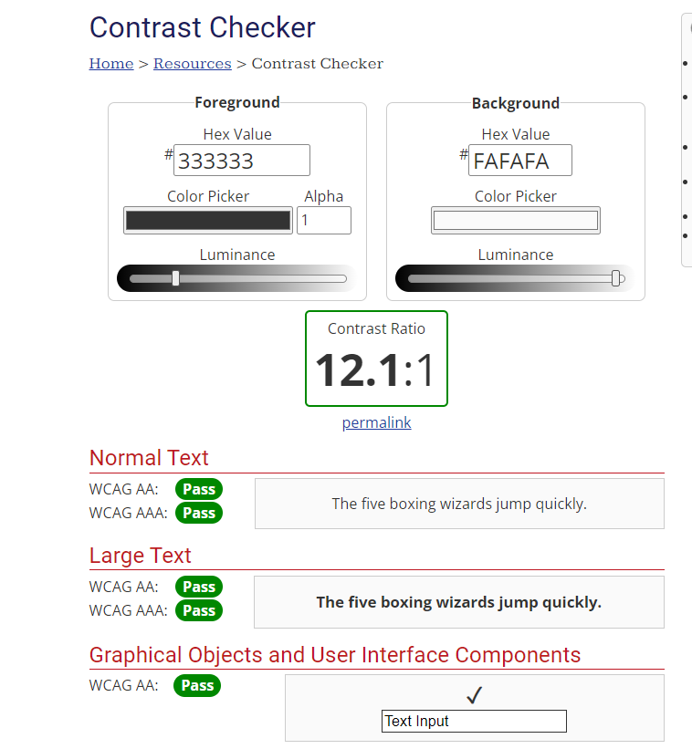

# Testing

## Main page Testing

### main page HTML testing:

### Main Page Hover testing:

No hover:

With hover:

No Hover

With hover

No hover:

With hover:

No hover:

With hover:

CV HTML Testing:

### Browser Testing

Chrome: (Had to zoom out to fit it all, so it looks a bit weird)

Firefox: (Had to zoom out to fit it all, so it looks a bit weird)

Edge: (Had to zoom out to fit it all, so it looks a bit weird)

Mac Safari:

Colour Accessability Testing:

## CV Page Testing

### Colour Accessability Testing:

### Browser testing:

Chrome (zoomed out to fit everything)

Microsoft Edge (zoomed out)

Firefox (zoomed out)

Mac Safari:

### HTML Validation

